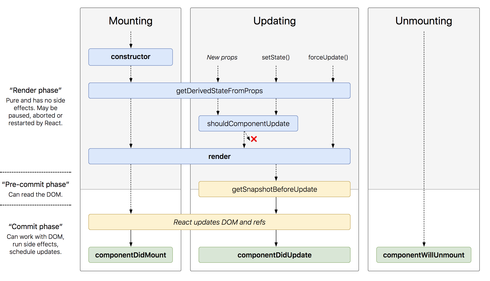

#### DEMO: Create Room List Component

**Function Component**
```js
const RoomList = props => {
  const { rooms } = props;
  return (
    <ol>
      {rooms.map((room, i) => {
        return <li key={i}>{room.name}</li>;
      })}
    </ol>
  );
};
```

**Props & Prop Types**

>Props is the interface for initializing a React component. It can be any valid javascript data type. React supports data type checking for Props. 

```javascript
import PropTypes from "prop-types";

RoomList.propTypes = {
  rooms: PropTypes.arrayOf(PropTypes.object)
};

```

**JSX**

```jsx
<ol>
  {rooms.map((room, i) => {
    return <li key={i}>{room.name}</li>;
  })}
</ol>
```

**Prop 'key'** 

A special component property

```js
return <li key={i}>{room.name}</li>;
```

**Class Component**
```js
class RoomList extends Component {
  render() {
    const { rooms } = this.props;
    return (
      <ol>
        {rooms.map((room, i) => {
          return <li key={i}>{room.name}</li>;
        })}
      </ol>
    );
  }
}
```
Compare with Function Component, Class Component has more features like State and life-cycle methods. 

**APIs & Lifecycle**

- setState()
- forceUpdate()
- Life-cycle Methods [Details](https://reactjs.org/docs/react-component.html#static-getderivedstatefromprops).


**Event**
```html
<button
  onClick={e => {
    const { rooms } = this.state || this.props;
    const newRooms = [...rooms];
    console.log(e);
    // console.log(e.nativeEvent);
    newRooms.splice(i, 1);
    this.setState({ rooms: newRooms });
  }}
>
  Detele
</button>
```

**State**

Initialize in constructor method
```js
  constructor(props) {
    super(props);
    this.state={
      rooms: [...props.rooms]
    };
  }
```

Update only by setState()
```js
this.setState({ rooms: newRooms });
```

**Context**

Define Context object
```js
const ThemeContext = React.createContext({
  theme: "dark",
  changeTheme: () => {}
});
```

Wrap components that will consume the Context
```html
<ThemeContext.Provider
  value={{ theme: this.state.theme, changeTheme: this.changeTheme }}
>
  <ThemeSelect />
  <RoomList key="list" rooms={RoomData.rooms} />
</ThemeContext.Provider>
```

Consume Context in target descendant components
```html
<ThemeContext.Consumer>
  {({theme, changeTheme}) => {
    return (
      <select onChange={changeTheme} value={theme}>
        <option value="dark">Dark</option>
        <option value="green">Green</option>
      </select>
    );
  }}
</ThemeContext.Consumer>
```

**Virtual DOM**

**How does React work?**


